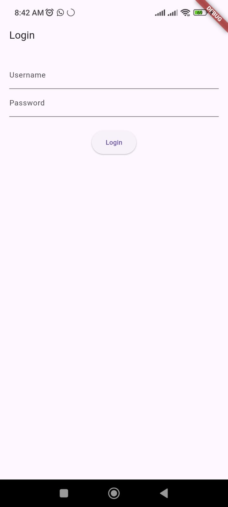

# Experiment 2: Activity & Navigation (Login Module)

## Student Information
* **Name:** Ayush  
* **Roll Number:** 23EACAD025  
* **Batch:** Alpha-1  
* **Section:** G-1  
* **Department:** Artificial Intelligence & Data Science  
* **Course:** B.Tech – AI & Data Science  
* **Year:** 3rd year | VI Sem

---

## Aim
To understand **widget navigation** and create a **login module** using Flutter.

---

## Procedure
1. Created a login screen with `TextField` widgets for username and password.  
2. Used `TextEditingController` for input handling.  
3. Implemented validation logic for credentials.  
4. Navigated to a new screen using `Navigator.push()` upon successful login.  
5. Displayed error messages using `SnackBar` for invalid credentials.  

---

## Output
The application validates login credentials.  

- **Login Screen**: Displays username and password fields with a login button.  


- **Successful Login**: On correct credentials, navigates to a new screen displaying **"Login Successful"**.  


---

## Conclusion
This experiment demonstrated **navigation between screens** in Flutter and implemented a basic **login validation system**.

---

## How to Run

1. Ensure you have **Flutter SDK** installed and added to PATH.  
2. Clone this repository and navigate to the experiment folder:
   ```bash
   git clone https://github.com/<classroom-org>/<repo-name>.git
   cd <repo-name>/Experiment_X
